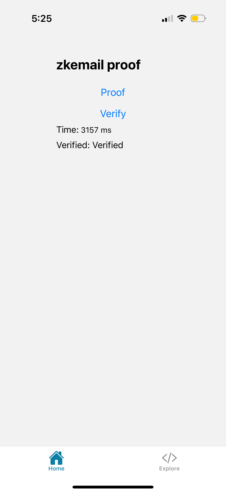
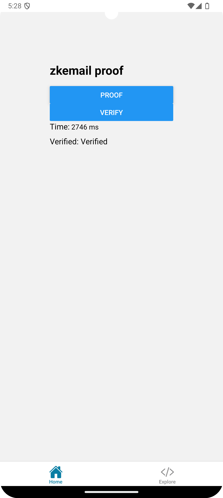

# Mopro React Native App with Expo framework

This is a sample [Expo](https://expo.dev) app that demonstrates how mopro can be used to prove a `zkemail` Noir circuit.

Learn more about Mopro: https://zkmopro.org.

## Get started

### 1. Install dependencies

```bash
npm install
```

### 2. Start the app

-   start an android emulator

    ```bash
    npm run android
    ```

-   start an iOS device

    ```bash
    npm run ios
    ```

### 3. Update Mopro Bindings

-   Get `MoproiOSBindings` and `MoproAndroidBindings` through [Rust Setup](https://zkmopro.org/docs/getting-started/rust-setup)
-   Update `modules/mopro/ios/MoproiOSBinding` with `MoproiOSBindings`

-   Copy the `MoproAndroidBindings/jniLibs` directory to `modules/mopro/android/src/main/jniLibs`. <br/>
    And copy `MoproAndroidBindings/uniffi` directory to `modules/mopro/android/src/main/java/uniffi`. <br/>

## Screenshots

### iOS



### Android


